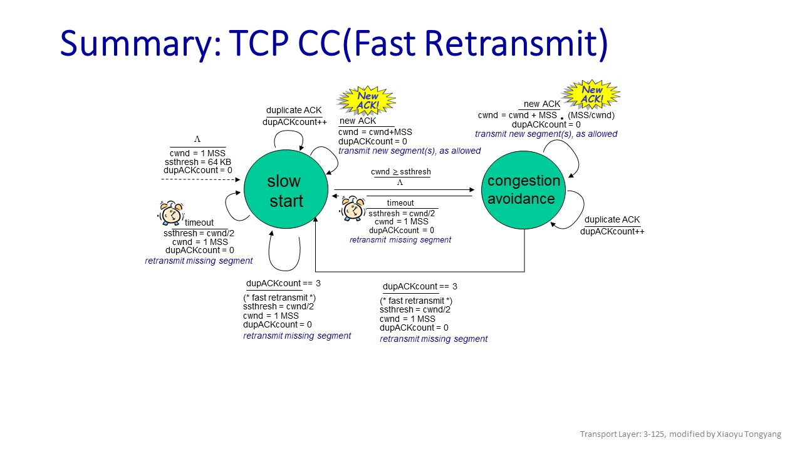

# Implementing TCP with UDP

@author: Xiaoyu Tongyang( [Github](https://github.com/fengkeyleaf/), fengkeyleaf@gmail.com ), 11/23/2022

## 1. Overview

This documentation is to give your guys a good taste of how I approached Project 3. Hope this can help you develop your own ideas and ways. First thing you need to do is NOT rush and dig into this documentation, but make sure that you already have good understanding of what we've learned about TCP in class. So I will not talk about those things we've already learned, just skip and leave them to your guys to figure them out.

Second thing you should be noticed is to carefully read and understand my assumptions about Project 3 b/c TCP is a very complex internet transportation protocol, you cannot implement every thing about it. In other words, the difficulty of this project is up to your choice, you can either only implement things required in the PDF, or you can implement as much features as possible in TCP.

One last thing, as you may notice, Project 3 is way more difficult than Project 2, after all we have many things to go over in this article. So it's recommended that start working on it ASAP.

Anyway, first let me give the assumptions here and then talk about the building blocks one by one.

> 1) Send/Receiver can send/deliver N bytes at a time ( Advertised-Window size is fixed ).
> 2) No re-connection. ( Initial sequence number is always 1 )
> 3) N cannot be zero. ( No Zero window )
> 4) No silly window syndrome.
> 5) Implement TCP-Tahoe and fast transmission. ( Slow start and congestion avoidance )
> 6) Discard out-of-order pkts for now.
> 7) Sender always send a signal to receiver to close. ( i.e. Sender and receiver cannot close at the same time )

※ My pseudocode may be given in some chapters, but be sure to understand the concepts first, not just read the pseudocode in a hurry and then start implementing it. Otherwise, you would have no idea of what the pseudocode is talking about.

## 2. TPC packet data structure

Since we're required to use UPD to stimulate TCP, we need to consider how to arrange our TCP packet(pkt) in UPD. Given the pkt length limitation from the PDF, here I give my own TCP pkt structure design as reference:


There is no much things to be discussed b/c we've learned them in class. So with this in mind, we first go into the 3-way handshakes to establish or close connection.

## 3. Establish and close connection

Regarding establishing connection with 3-way handshakes, I'll just skip it. As for closing the connection, which isn't explicitly required in the PDF, the workflow is very similar to establishing connection. First, let's say, the sender send a pkt with FIN = 1 and ACK = 1 to the receiver, and the receiver receives this pkt and knows, Oh, the other side is about to close the connection, so I first notify the upper-layer application to close, and then send an ack pkt with FIN = 1 and ACK = 1 to the sender, and finally close the socket. Then, the sender receive the ack pkt, also notify its app to close and then start a wait-time timer. Once the timer timeout, the sender's socket is closed. At this point, we're done with closing connection. With all of this, it's time to give my pseudocode for this part:

```java
// Ignore the function SENDDATAEVENT() for now......
Algorithm CONNECTIONEVENT()
    // 3-way handshakes to establish connection with the receiver 
    // and determine N based on the information.
1.  if try to establish connection
2.     SENDDATAEVENT( 1 byte data )
3.     Notify the upper-layer application the advertised-window size, N.
    // Close the connection with the receiver 
    // when received a signal to close from the application.
    // And send a signal to the receiver and waiting for its FIN ack.
4.  else ACK = FIN = 1 
5.       SENDDATAEVENT( 1 byte data )
```

I also provide my hand-drawn examples in PDF, named TCP examples.pdf, you can check it out. 

## 4. Flow Control( FC )

### 4.1 Basic Concepts

At first glance, you may be confused about the two windows in TCP, flow control window(fcw) and congestion control window(cwnd). As I mentioned in the discord, there are similar, but have different functionalities. In my opinion, fcw controls how much data sent per pkt while cwnd controls how many pkts sent per RTT b/c fcw is controlled by the advertised-window size in the recevied pkt header from other side, while cwnd is controlled by how many pkts received per RTT.

And they both can control how much data sent to the network. Let's take a real-world example, on the highway, fcw is like one type of car, like sedan, bus, or truck, it can be sometimes small, sometimes very big, while cwnd is like how many cars passing during a period of time regardless of their size.

But how do we understand or implement FC? I think this is the most important part. And you can think in this way: cwnd is analogue to fcw. But in fcw we're dealing with byte units while pkts in cwnd. What does this mean? Let's look into the following example[^1]:


Similarly, we have the four parts in fcw as well, which are the four categories in the image. So assume the sender received an ack pkt which indicates the advertised-window size, N, is 6 units or 6 B(Highlighted in red), then the sender is only allowed send a pkt with the payload of length 6, also meaning that the upper-layer app is allowed to give the sender 6-byte file data to send. Any data of length more than 6 should be refused by the sender. The rest of job is not much difference than cwnd, sender receive a new ack pkt, ack not-yet-acked bytes, move the window to the right. In the example below[^1], ack pkt with ack(32) was received, slide the window and be prepared to send the next.


And you may notice, the numbers in the window are seq's # as well. E.g. seq's # of the next pkt to be sent for the example above is 52, lying in the Usable Window range.

### 4.2 Implementation

At this point, I think you should have no problem with the basic concepts about FC. However, another problem arises, that is, how do we actually implement this idea? Do you really need create the window-like thing in our program? Well, the answer is NO! According to the slides[^2] from cs.uni.edu, only two pointers in sender and one pointer in receiver are sufficient, No other things needed! Let's first look into the sender side.


On the one hand, sender only has two pointers to do the job: 1) LastByteAcked + 1(base, b) and 2) LastByteSend + 1(nextSeqNum, nsn). Every time, sender checks to see if nsn >= b + N, if yes, then send the data, otherwise, refuse to send. On the other hand, receiver has one pointer to remember: NextByteExpected(expectedSeqNum, esn), if seq's # != esn, this is an out-of-order pkt, either discard it or buffer it for re-ordering.

For simplicity, my program just discards out-of-order pkts in my implementation b/c TCP spec doesn’t say how to handle those pkts, it's up to implementer. So you can implement out-of-order pkt buffering in your implementation, but, of course, more difficult to do so. And this is how FC works, if you still don't get the point, check out my hand-drawn examples in the PDF as well.

## 5. Congestion control( CC )

Still no discussion about CC here, already learned in the class. But with introducing FC, we have to think about how to combine these two together! So we need to consider how CC effects FC. Let's first consider the simplest case where cwnd is always 1, i.e. CC has no effects. Every time, sender is only allowed to send one pkt at a time, so the condition won't change, still nsn >= b + N, but with CC enabled, let's say cwnd has increased to 4. This time sender is allowed to send 4 pkts at a time. So how do we restrict the sender not to send beyond the limit? Is nsn >= b + N still correct? The answer is, again, No. The correct should be: nsn >= b 4N b/c 4 pkts means the receiver can receive 4 pkts with each length of N.

You may wonder why this mechanism is necessary, just implementing the upper-lay app and TCP socket in one program would make our life easier? You could do that, but in reality, they are two separate layers, i.e. they're running in parallel and TCP socket layer is used by all apps, you can not just have one TCP socket layer for each app, too computationally expensive. Again,  check out the PDF for more concrete examples.

By the way, as reference, post the CC FSM without Fast Recovery here. ( This is my modified version, the original is from Computer Networking: A Top-Down Approach 8th edition[^3] ):



And I'll introduce the pseudocode for it later on, in TCP sender and receiver chapters.

## 6. Timer

According to this article, [TCP Timers | Time Out Timer | Time Wait Timer](https://www.gatevidyalay.com/tag/tcp-zero-window-probe/), there are 4 important timers in TCP implementation, but we'll only use two of them, time out timer and time-wait timer. We're very familiar with the timeout timer, skip it. Regard to time-wait timer, which is not explicitly required in the Project 3, it's used when a TCP socket is closing. Here is its typical procedure[^4]:

> - Sender starts the time wait timer after sending the ACK for the second FIN segment.
> - It allows to resend the final acknowledgement if it gets lost.
> - It prevents the just closed port from reopening again quickly to some other application.
> - It ensures that all the segments heading towards the just closed port are discarded.
> - The value of time wait timer is usually set to twice the lifetime of a TCP segment.

And you'll see how I combine them with the send and receiver in later chapters.

## 7. Internet Checksum

Internet checksum is the last thing I want to talk about before giving pseudocode for sender and receiver, and this is not covered in the class. There are many good online references to it:

> [Error Detection in Computer Networks](https://www.geeksforgeeks.org/error-detection-in-computer-networks/)
>
> [Calculation of TCP Checksum](https://www.geeksforgeeks.org/calculation-of-tcp-checksum/)
>
> [Internet Checksum: Simplified Step-by-Step Calculation Guide](https://www.alpharithms.com/internet-checksum-calculation-steps-044921/)

So I won't spend too much time discussing how to calculate it, but wanna focus on how to implement it with bit manipulation. First, introduce an overall checksum pseudocode[^5]:

```java
// Calculate internet checksum, general version.
Algorithm CHECKSUM( d ) 
Input. Byte data array containing pseudo IP header, TCP header and TCP body.
Output. Checksum for the input byte array.
1.  Convert data into a series of 16-bit integers;
2.  Calculate the sum of all 16-bit integers, allowing for the carry bit wrap around;
3.  Take the 1’s complement of the final sum (flip the bits)
```

The problem here is that given bytes, how to compute checksum with **16-bit** integers. So how can we achieve this with bit manipulation? Recall the size of primitive data types. Take Java as an example, short has the size of 2 B, which is 16 bits, but for more scalability and simplicity, I will use int( 4 B ) to do the work. First thing we need to do is combine 2 bytes into one int. The way I did is that, let's say, 2 bytes, b1 and b2, first left shift b1 by 8 units and get a new number n, then n | b2, thus get the int to represent the 2 bytes in just on int.


Next thing to consider is how to achieve wrap-around carry bit. So we should think about where the carry bit is. The answer is that it should be at the 16th bit( if counting bits from right to left ). So what we should do is simple, first determine if there is 1 at 16th bit, if yes, reset this bit to 0, and add 1 to the number.


Putting everything together we get the following algorithms.

```java
// Calculate internet checksum, bit manipulation version.
Algorithm CHECKSUM( d ) 
Input. Byte data array containing pseudo IP header, TCP header and TCP body.
Output. Checksum for the input byte array.
// Counting bits from right to left.
1.  d <- padding( d ) // Make sure that the length of d is even.
2.  I <- 32-bit integer array of length floor( len( d ) / 2 ).
3.  for every two consecutive bytes in d, ( i, j )
4.      do n <- ( i & 0xff ) << 8 ) | ( j & 0xff ) // ( byte & 0xff ): byte to unsigned int in java
5.         Append n to I.
6.  w <- 1 << 16 // Should be 65536 in decimal
7.  cw <- ~w // Should be -65537 in decimal
8.  s <- 0
9.  for every 32-bit integer n in I
10.     do s += n
11.        if s & w != 0
12.           then s = ( s & cw ) + 1
13.  s = Make bits prior to 15th all zero in ~s
14.  return s

// Checksum Validation, bit manipulation version.
Algorithm CORRUPT( d, c )
Input. Received TPC pkt in byte array from the sender, but its checksum field should be set to 0.
       and checksum from the received TCP header.
Output. Tells if received pkt is corrupted or not.
1.  cs <- CHECKSUM( d )
2.  return ~( cs + ~c ) != 0 // ~: complement
```

## 8.  TCP sender

With all of the building blocks, we're ready to define the behavior of TCP sender and its events. Similarly, post sender extended FSM first[^3], you can take a look into it:


To make it more "implementable", next I'll give my sender's pseudocode:

```java
// Define the behavior of sender.
Algorithm SENDER()
1.  Initilize the following variables:
        timeoutInterveral and initiSeqNum (Up to your choice), 
        base = nextSeqNum = initialSeqNum(Usuaally 0),
        n <- N, cwnd <- 1 MSS, t <- timeout timer, SYN = 1, FIN = 0,
        ssthresh <- DEFAULT_SSTHREAD(Usuaally 64 KB)
2.  Continue listening to incoming events. 
    Call the appropriate procedure to handle the event, depending on its type.
```

```java
// Sender events.
Algorithm SENDDATAEVENT( d )
Input. Byte data passed from the upper-layer application.
    // length( d ) fits into the advertised window size.
1.  if nextSeqNum < base + n
        // Cook the packet, send and start the timer.
2.      then sndpkt[ nextSeqNum ] = make_pkt( nextSeqNum, d, chksum, SYN, FIN )
3.           udt_send( sndpkt[ nextSeqNum ] )
4.           if t is not already running
5.              then start t, setting its next seqence number to nextSeqNum and timeout interveral to i.
6.           nextSeqNum += length( d )
        // d is too large to be received by the receiver, refuse to send.
7.      else refuse_data( d )


Algorithm RECEIVEPACKETEVENT( p )
Input. Packet received from the receiver side.
    // Acknowledgment received
1.  if notcorrupt( p )
2.      then ack <- getacknum( p )
3.           if first time to receive ack
4.              base = ack
5.              dupACKcount[ ack ] = 1
6.              if base == nextSeqNum or getseqnum( t ) < base
7.                 then stop t
8.                 else if there are still unACKed segments
9.                         then start t, setting its next seqence number to 
                                nextSeqNum of the oldest unACKed segments
                                and timeout interveral to i.
                // Ack pkt loss may have happened,
                // just count duplicate and no response.
10.             if invalid ack pkt received when ack == b
11.                 then return
                // Established the connection, ready to send data.
12.             if getSyn( p )
13.                 then SYN = 0
14.                      return
                    // Closing the connection.
15.                 else if getFIN( p )
16.                         then start TIME_WAIT timer and
17.                              close the socket when the timer timeout.
18.                              return
                // Congestion Control
                // Note that N here is the window size received fromt the other side!
19.             if isSlowStart() // Slow start
20.                 then cwnd += 1
21.                      n += N
22.                      if cwnd >= ssthresh
23.                         then go into Congestion Avoidance phase
24.                              c <- cwnd
25.                 else c-- // Congestion Avoidance
26.                      if c == 0
27.                         then cwnd += 1
28.                             c = cwnd
29.                             n += N
30.          else dupACKcount[ ack ]++
31.               if dupACKcount[ ack ] == 3 // Fast Retransmission
32.                  TIMEOUTEVENT()
     // Corrupted pkt received, wait for the timer to timeout and resend.


Algorithm RESET()
1.  ssthresh = floor( cwnd / 2 )
2.  cwnd = 1 MSS
3.  n = N
4.  reset( dupACKcount )
5.  Go into Slow Start phase.


Algorithm TIMEOUTEVENT()
1.  Stop t
2.  if not try to establish connect or to close congestion
3.     then RESET()
4.  Retransmit not-yet-acked segment with smallest seq. #.
5.  Restart t
```

## 9. TCP receiver

Next is to define the behavior of TCP receiver, first give its FSM[^3]:


Similarly, to make it more "implementable". introduce my pseudocode next:

```java
// Define the behavior of Receiver.
Algorithm RECEIVER()
1.  Initilize the following variables:
        expectedSeqNum = 0, 
        advertised-window size and initiSeqNum ( Based on your choice )
2.  ackpkt = make_pkt( expectedSeqNum, ACK, chksum )
3.  Waiting for the sender to connect with 3-way handshakes to establish the connection.
4.  Continue listening to incoming events. 
    Call the appropriate procedure to handle the event, depending on its type.
5.  Close the connection when received a signal from the sender.
```

```java
// Receiver events.
Algorithm RECEIVEPACKETEVENT( p )
Input. Packet received from the sender side.
1.  if notcorrupt( p ) and hasseqnum( p, expectedSeqNum ) // Receive pkt event
2.      then d = extract( p )
3.           expectedSeqNum += length( d )
4.           SYN <- 0, FIN <- 0
             // Established the connection, ready to receive data.
5.           if getSyn( p )    
6.               then SYN = 1    
                 // Close the connection
7.               else if getFIN( p ) && getAkc( p )
8.                       then FIN = 1
9.                            Notify the application to close 
                              and then close the receiver socket.
                 // Normal acknowledgement
10.              else deliver_data( d )
11.          ackpkt = make_pkt( expectedSeqNum, ACK, SYN, FIN, chksum )
12.          udt_send( ackpkt )
13.     else udt_send( ackpkt ) // Any other events
```

Upon defining the behavior of two sides, we're already to dig into the file operator, the upper-layer application. And also we're done with discussing the part 1 in the Project 3 PDF. We've conquered half of the project, cheers!

## 10. File operator( FTP )

The behavior of file operator is relatively simpler than the sender and receiver. In summary, it has the following typical functions:

> - Notify TCP socket to connect to the other side.
> - Read a file from disk and feed the sender with file data in bytes.
> - Retrieve a file received from the sender when it's ready to do so.
> - Notify TCP socket to close.

So it would not be hard to come up with its pseudocode:

```java
// Defind the behavior of the upper-layer application.
Algorithm FILEOPERATOR()
1.  if try to read data from a file and send via the internet
2.     then Create a sender TCP socket and notify it to establish the connection,
            and then waiting for it to give back the advertised-window size, N.
3.          Continue reading date from the file with buffer size N and feed the socket with the buffer.
4.          Notify the socket to close when there is no more data to read from the file.
5.          Waiting for the sokcet to close and terminates.
6.     else Create a receiver TCP socket waiting for the handshake to build the connection.
7.          Continue writing data received from the socket to the file stream after the connection built.
8.          Terminates and notify the socket to close when received a closing signal from the socket.
```

The only thing I wanna discuss here is the way to notify the receiver when it's done with transferring the file, which is defined in the Project 3 PDF by sending pkt of length less than 512. You could go along with it, but it has a fatal bug, that is, there is no way to know that we're done with the transfer when the length of a file happens to be the multiple of 512. 

So I will introduce a more correct way to do so. To achieve this, you need the FIN bit in the flags field of TCP header. FIN means that Last packet from sender[^6]. So a pkt with FIN on is sent to the receiver to let their know, "OK, we're done, you can give the file data to an upper-layer application." However, this would introduce a tiny problem. If you look into the way of closing connection, the sender and receiver would both send pkt with FIN and ACK on to communicate, so there must be a way to differentiate a last pkt with a closing pkt. And as a good practice, I leave this up to you to figure it out if you're interested in implementing in this way.

## 11. Debug and testing

### 11.1 Debug

Debug is important in this project. So I would share my debugging way and you could build your own based on mine. My debugging method is similar to the way from those real-world network applications, like spring boot. In other words, print out logs to debug!


As you can see, my program print out many logs, like pkt sent with seq. #, length, and also some warning information, such as pkt loss, pkt retransmit. In this way, you can know what've happened to your program. But it would be painful when transferring a larger file or introducing some failure, this would take patience and time to debug, so just feel free to take a rest when you cannot stfand with it anymore.

### 11.2 Testing

I will test my FTP program with the following test cases:

> Test Locally
>
> - Transfer without simulating failure.
> - Transfer with pkt loss.
> - Transfer with ack pkt loss.
> - Transfer with pkt corruption.
> - Transfer larger file ( 1~3 MB ) with CC off.
> - Transfer larger file ( 1~3 MB ) with CC on
>
> Test in the real-world network.
>
> - Transfer larger file( 1~3 MB ), but no simulating failure and CC is on

I recorded [a test video](https://youtu.be/Oi7jKr5mKfc) to show all the test cases and explained what happened in the testing process.

## 12. Implementation tips

A proper programming language would make your life easier. So in my opinion, Python is recommended b/c it's easy to cook pkts in bytes in python while it's really painful to do so in Java. But with the choice of python, you may need find a way to calculate checksum with bit manipulation and make sure to choose right data type b/c python doesn't differentiate primitive data types. 

Other thing I wanna share about Java is how to cook pkts in bytes. There are two useful built-in Java classes:

> - [BitSet](https://docs.oracle.com/en/java/javase/17/docs/api/java.base/java/util/BitSet.html).
> - [ByteBuffer](https://docs.oracle.com/en/java/javase/17/docs/api/java.base/java/nio/ByteBuffer.html)

The first one is to do bit manipulation and the second is a byte container where you can put other data types into it, it functions in the similar way to [strcut.pack()](https://docs.python.org/3.9/library/struct.html?highlight=pack#struct.pack) in python. You can find many online articles teaching you how to use them, so I'll not dig into them here. But I'd like to emphasize the decoding and encoding order of ByteBuffer, it's counter-intuitive to what you'd have expected initially.

OK, at this point, I think no more things to be discussed. Don't hesitate to contact me if you feel something is wrong b/c I cannot guarantee that I'm absolutely correct. And it would be thankful to post your question in the discord and others could look into it if you both happens to have the same problem.

## 13. Acknowledgements

1. CSCI 651 Found of Computer Networks,  Minseok Kwon, RIT.
2. Chapter 3, Transport Layer, Computer Networking: A Top-Down Approach 8th edition, Jim Kurose, Keith RossPearson, 2020.
3. Slides from diesburg, [cs.uni.edu](http://www.cs.uni.edu/~diesburg/courses/cs3470_fa14/sessions/s29/s29.pdf).
4. [网络协议 - TCP 协议详解](https://pdai.tech/md/develop/protocol/dev-protocol-tcpip.html)
5. [TCP Timers | Time Out Timer | Time Wait Timer](https://www.gatevidyalay.com/tag/tcp-zero-window-probe/)
6. [Transmission Control Protocol](https://en.wikipedia.org/wiki/Transmission_Control_Protocol)

[^1]:[网络协议 - TCP 协议详解](https://pdai.tech/md/develop/protocol/dev-protocol-tcpip.html#tcp%E6%BB%91%E5%8A%A8%E7%AA%97%E5%8F%A3)
[^2]:Slides from diesburg, [cs.uni.edu](http://www.cs.uni.edu/~diesburg/courses/cs3470_fa14/sessions/s29/s29.pdf).
[^3]: Chapter 3, Transport Layer, Computer Networking: A Top-Down Approach 8th edition, Jim Kurose, Keith RossPearson, 2020.
[^4]: [TCP Timers | Time Out Timer | Time Wait Timer](https://www.gatevidyalay.com/tag/tcp-zero-window-probe/)
[^5]:[Internet Checksum: Simplified Step-by-Step Calculation Guide](https://www.alpharithms.com/internet-checksum-calculation-steps-044921/)
[^6]:[Transmission Control Protocol](https://en.wikipedia.org/wiki/Transmission_Control_Protocol)
