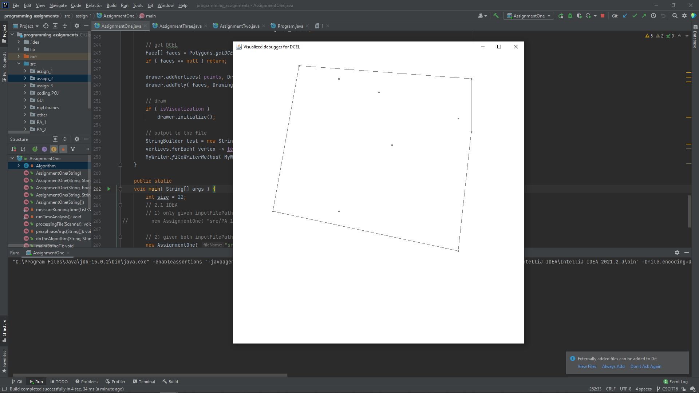
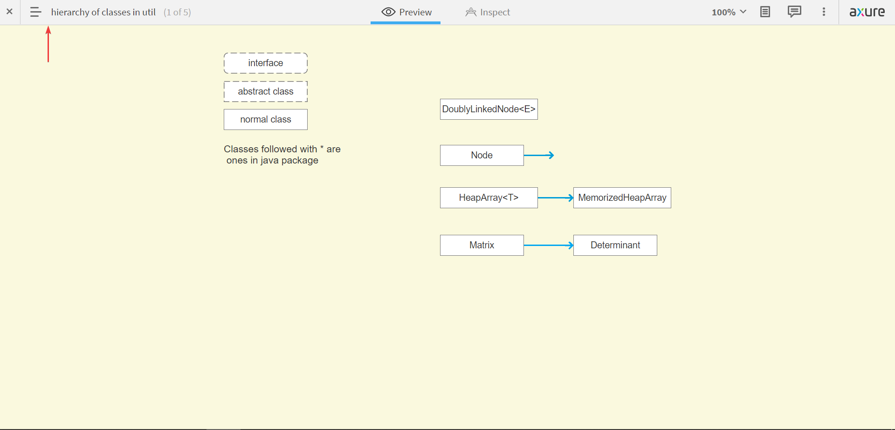
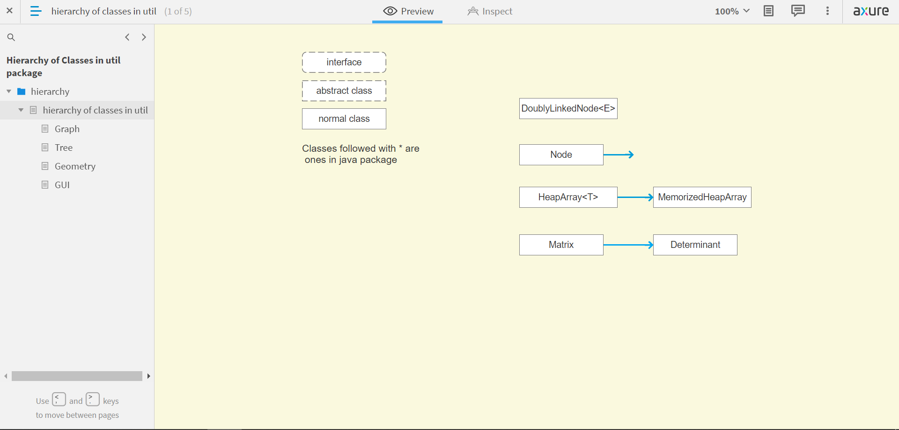
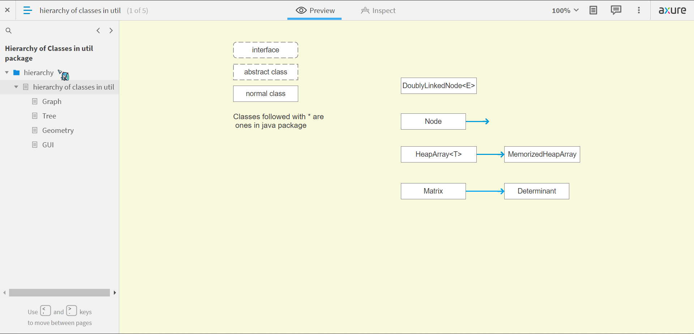
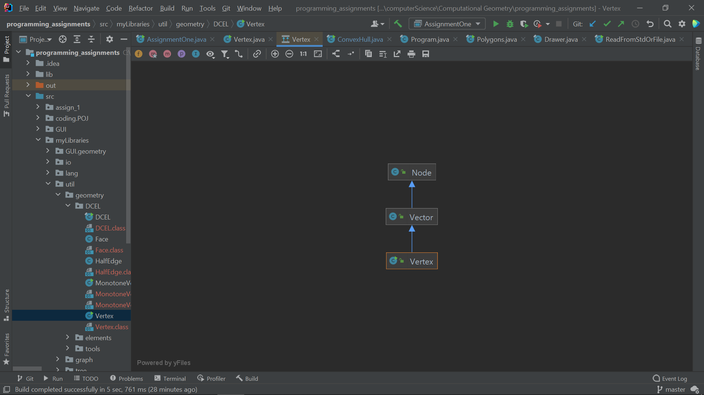

# Instructions for Assignment 1

## 1. Compilation

My program for Assignment 1 only uses Java stand library, [JDK 15](https://docs.oracle.com/en/java/javase/15/docs/api/index.html). So no need to import any external libraries.

## 2. Feed with input data

For feeding the program with input files, there are two ways to do so: 1) IDEA; 2) Command line. Note that the program uses the first, running in IDEA, by default, and both methods support reading input from stdin, System.in, in case that the supplied input file cannot be found.

### 2.1 IDEA

One can run the program in IDEA with two constructors:

```java
// 1) only given inputFilePath
public AssignmentOne( String fileName, boolean isVisualization, int originWidth, int originHeight ) {
    this( fileName, null, isVisualization, originWidth, originHeight );
}

/**
 * constructs to create an instance of AssignmentOne
 *
 * @param fileName Path to the input file
 * @param filePath Path to the output file (optional)
 * @param isVisualization Turn on Visualization? (optional)
 * @param originWidth window width of input data (optional)
 * @param originHeight window height of input data (optional)
 * */

public AssignmentOne( String fileName, String filePath,
                     boolean isVisualization, int originWidth, int originHeight ) {
    this.isVisualization = isVisualization;
    this.originWidth = originWidth;
    this.originHeight = originHeight;
    isIDEA = true;

    ReadFromStdOrFile.readFromFile( inputFilePath  = fileName, this );
    doTheAlgorithm( outputFilePath = filePath, prefix );
}
```

For example:

```java
int size = 22;
// 1) only given inputFilePath
new AssignmentOne( "src/PA_1/problem_1/1", false, size, size );

// 2) given both inputFilePath and outputFilePath
new AssignmentOne( "src/PA_1/problem_1/1", "src/assign_1/res1.txt", true, size, size );
```

The first one reads an input file named "1" in the path "src/PA_1/problem_1/" and outputs the result in the file named "0" in the path "src/assign_1/", and won't visualize the output. So by default, output file names will be 0, 1, 2, and so on,

On the other hand, the second does the same thing except that the output file name is res1.txt and visualization is turned on.

Note that one has to pre-append "src/" in the front of file path for input and output files, or otherwise the program won't find the file and try to read from stdin, or report errors.

### 2.2 Command Line

To use command line, one first needs to go to the "src" folder and then follow the following command line formats:

> javac programPath

> java programPath -inputFilePath inputFilePath [  -originWidth originWidth -originHeight originWidth -outputFilePath outputFilePath -turnOnVisualization turnOnVisualization ]

| Identifier           | Value               | Description                 | Example            | Default   |
| -------------------- | ------------------- | --------------------------- | ------------------ | --------- |
|                      | programPath         | Path to the java entry file | AssignmentOne.java |           |
| -inputFilePath       | inputFilePath       | Path to the input file      | PA_1/problem_1/1   |           |
| -outputFilePath      | outputFilePath      | Path to the output file     | assign_1/1         | assign_1/ |
| -turnOnVisualization | turnOnVisualization | Turn on Visualization?      | true               | false     |
| -originWidth         | originWidth         | original window width       | 22                 |           |
| -originHeight        | originHeight        | original window height      | 22                 |           |

which means that one should use this constructor in this context:

```java
/**
 * constructs to create an instance of AssignmentOne with arguments
     * */

public AssignmentOne( String[] args ) {}
```

For example,

>  javac .\assign_1\AssignmentOne.java

> java .\assign_1\AssignmentOne.java -inputFilePath PA_1/problem_1/1

As we can see, we first compile the main entry java file, AssignmentOne.java, and link other imported files to the program. And then we run it with input file path, PA_1/problem_1/1. After running the algorithms, the program will output the result into a file named, 1, in the same path as the entry java file since we don't provide output file path. and it won't visualize the output.

So by default, visualization is off, and output file names will be 0, 1, 2, and so on, if no output file path given. In other words, if we use the following arguments:

> java .\assign_1\AssignmentOne.java -inputFilePath PA_1/problem_1/1 -outputFilePath assign_1/res1.txt -turnOnVisualization true -originWidth 22  -originHeight 22

The output file name will be "res1.txt", and the program will show visualized output through Java GUI tool kits.

Note: 

1. Please do not use arguments in IDEA, which uses a different path confiuguration.
2. java.lang.ClassNotFoundException may occur because some java files have not been complied and linked to the program, so we have to compile them manually. But this would not happen since I provided all complied files in the zipped file along with other files, unless one wants to modify and re-compile. 

## 3. Visualization 

For now, the program will visualize the output if it's turned on. Like this one:



And in the mechanism behind the visualization, please see more info in Instructions for Assignment 2.md.

## 4. Hierarchy of Classes in util package

In order to get a better understanding of the hierarchy relation of java classes, mainly the ones in my own util package, I provide an overview of it in Axure cloud. Firstly, open the following link with the password "himea":

Axure cloud: [Hierarchy of Classes in util package](https://e5aien.axshare.com)

And you will see this page and click the place at which the red arrow is pointing to see other pages:



And then you will get:



In this picture, we can learn that the Class Node have several subclasses, and Class MemorizedHeapArray inherits from Class HeapArray<T\> and has no subclass. Let's see the hierarchy chain of the Class Vertex for DCEL. We first set the page scale to 75% and then select the Geometry page on the left and find the DCEL part, and click Class Vertex widget, just as the following gif shows:



And as you can see, there are others classes not used in this assignment. They are the ones that may show in next assignments or that are set for other purposes. Just look into the ones appeared in the current assignment for now.

Finally, of course, you can use the Diagrams in IDEA to do the same thing, like:



At this point, nothing to explain and I plan to use similar configuration here for other assignments as well. Thanks for reading, let me know if there are anything ambiguous.

