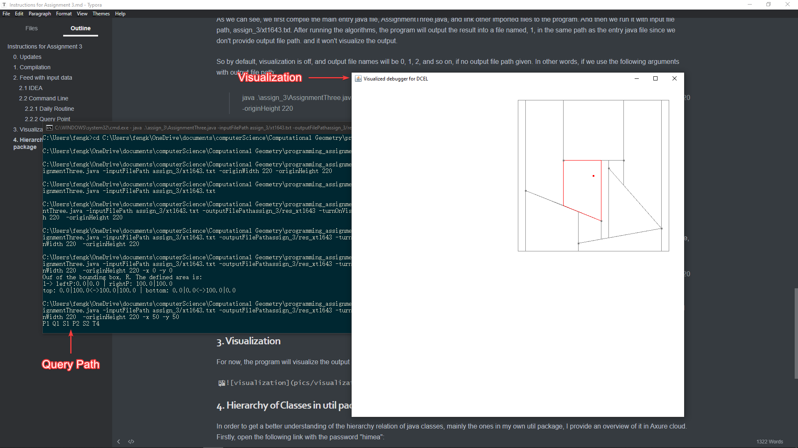
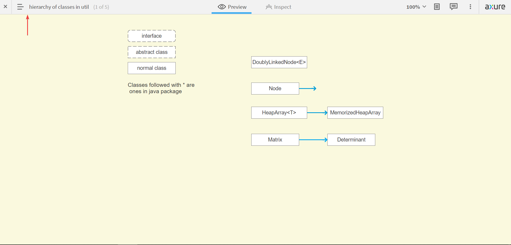
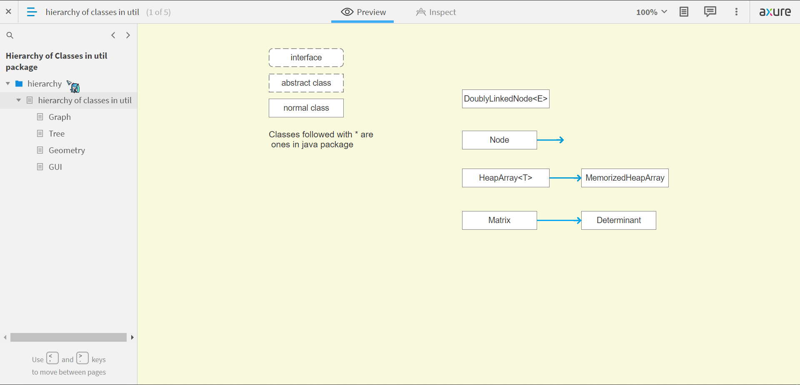
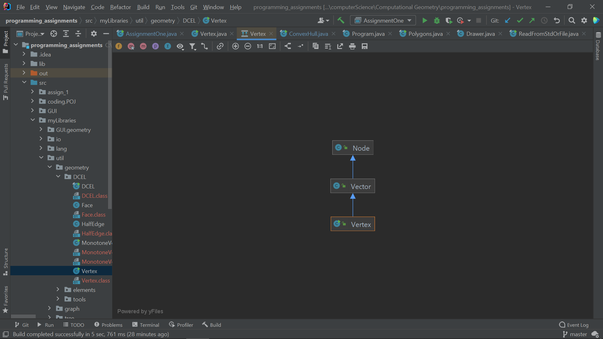

# Instructions for Assignment 3

## 0. Updates

1. Two command line parameters: originWidth and originHeight for visualization are now optional, if visualization was turned off.
2. Support Query point command lines.

## 1. Compilation

My program for Assignment 3 only uses Java stand library, [JDK 16](https://docs.oracle.com/en/java/javase/16/docs/api/index.html). So no need to import any external libraries.

## 2. Feed with input data

For feeding the program with input files, there are two ways to do so: 1) IDEA; 2) Command line. Note that the program uses the first, running in IDEA, by default, and both methods support reading input from stdin, System.in, in case that the supplied input file cannot be found.

### 2.1 IDEA

One can run the program in IDEA with three constructors:

```java
// 1) only given inputFilePath
public AssignmentThree( String fileName, boolean isVisualization, int originWidth, int originHeight ) {}

// 2) given both inputFilePath and outputFilePath
public AssignmentThree( String fileName, String filePath, boolean isVisualization, int originWidth, int originHeight ) {}

/**
 * constructs to create an instance of AssignmentThree
 *
 * @param fileName Path to the input file
 * @param filePath Path to the output file (optional)
 * @param x x coordinate of the query point (optional)
 * @param y y coordinate of the query point (optional)
 * @param isVisualization Turn on Visualization? (optional)
 * @param originWidth window width of input data (optional)
 * @param originHeight window height of input data (optional)
 * */

// 3) given query point
public AssignmentThree( String fileName, String filePath, double x, double y,
                       boolean isVisualization, int originWidth, int originHeight ) {}
```

For example:

```java
int size = 34;

// 1) only given inputFilePath
new AssignmentThree( "src/PA_1/problem_2/test_1/3", true, size, size );

// 2) given both inputFilePath and outputFilePath
new AssignmentThree( "src/PA_1/problem_2/test_1/3", "src/assign_2/res3.txt", true, size, size );

// 3) given query point
new AssignmentThree( "src/assign_3/10", "src/assign_3/res_10", -20, -20, true, size, size );
```

The first one reads an input file named "3" in the path "src/PA_1/problem_2/" and outputs the result in the file named "0" in the path "src/assign_2/", and won't visualize the output. So by default, output file names will be 0, 1, 2, and so on.

As for the additional two parameters, originWidth and originHeight, they define the window size of input data. Say we input the following data:

```java
6
-10 -10 10 10
-1 -2 9 0
2 3 9 0
-3 2 5 0
-6 -2 -2 0
-5 3 4 5
-6 -2 4 -5
```

And define the input window size is 34 x 34, and then the program will map this imaginary window to the visualization window( 600 x 600 by default ) by Java GUI kits. So the input window size should be s x s, which is a regular quad, and its area should cover the whole lines to show them fully. In other words, the two additional parameters define a bounding box for the canvas that covers all the geometric shapes needed to show.

On the other hand, the second does the same thing except that the output file name is res1.txt and visualization is turned on. And the third one just feeds the program with query point.

Note that one has to pre-append "src/" in the front of file path for input and output files, or otherwise the program won't find the file and try to read from stdin, or report errors.

### 2.2 Command Line

#### 2.2.1 Daily Routines

To use command line, one first needs to go to the "src" folder and then follow the following command line formats:

> javac programPath

> java programPath -inputFilePath inputFilePath [ -originWidth originWidth -originHeight originWidth  -x x -y y -outputFilePath outputFilePath -turnOnVisualization turnOnVisualization ]

| Identifier           | Value               | Description                                | Example              | Default   |
| -------------------- | ------------------- | ------------------------------------------ | -------------------- | --------- |
|                      | programPath         | Path to the java entry file                | AssignmentThree.java |           |
| -inputFilePath       | inputFilePath       | Path to the input file                     | assign_3/xt1643.txt  |           |
| -outputFilePath      | outputFilePath      | Path to the output file (Optional)         | assign_3/res_xt1643  | assign_3/ |
| -turnOnVisualization | turnOnVisualization | Turn on Visualization? (Optional)          | true                 | false     |
| -originWidth         | originWidth         | original window width (Optional)           | 220                  |           |
| -originHeight        | originHeight        | original window height (Optional)          | 220                  |           |
| -x                   | x                   | x coordinate of the query point (Optional) | 50                   |           |
| -y                   | y                   | y coordinate of the query point (Optional) | 50                   |           |

which means that one should use this constructor in this context:

```java
/**
 * constructs to create an instance of AssignmentThree with arguments
 * */

public AssignmentThree( String[] args )
```

For example,

>  javac .\assign_3\AssignmentThree.java

> java .\assign_3\AssignmentThree.java -inputFilePath assign_3/xt1643.txt

As we can see, we first compile the main entry java file, AssignmentThree.java, and link other imported files to the program. And then we run it with input file path, assign_3/xt1643.txt. After running the algorithms, the program will output the result into a file named, 0, in the same path as the entry java file since we don't provide output file path. and it won't visualize the output.

So by default, visualization is off, and output file names will be 0, 1, 2, and so on, if no output file path given. In other words, if we use the following arguments with output file path:

> java .\assign_3\AssignmentThree.java -inputFilePath assign_3/xt1643.txt -outputFilePathassign_3/res_xt1643 -turnOnVisualization true -originWidth 220  -originHeight 220

The output file name will be "res_xt1643", and the program will show visualized output through Java GUI tool kits.

Note: 

1. Please do not use arguments in IDEA, which uses a different path configuration.
2. java.lang.ClassNotFoundException may occur because some java files have not been complied and linked to the program, so we have to compile them manually. But this would not happen since I provided all complied files in the zipped file along with other files, unless one wants to modify and re-compile. 

#### 2.2.2 Query Point

Besides the command line configurations above, query point command line is also provided for this assignment. To query a point in the resulted search structure, tree like DAG, one needs to explicitly give the coordinates of the query point in the command line arguments, like this one:

> java .\assign_3\AssignmentThree.java -inputFilePath assign_3/xt1643.txt -outputFilePathassign_3/res_xt1643 -turnOnVisualization true -originWidth 220  -originHeight 220 -x 50 -y 50

This means that the program will query the point( 50, 50 )  in the structure and output the path string, adjacency matrix as well as visualization with the trapezoid map and query result. In other words, no query points given, no query path and its visualization as well.

## 3. Visualization 

For now, the program will visualize the output of the example above if it's turned on. Like this one with query point given:



## 4. Hierarchy of Classes in util package

In order to get a better understanding of the hierarchy relation of java classes, mainly the ones in my own util package, I provide an overview of it in Axure cloud. Firstly, open the following link with the password "himea":

Axure cloud: [Hierarchy of Classes in util package](https://e5aien.axshare.com)

And you will see this page and click the place at which the red arrow is pointing to see other pages:



And then you will get:


In this picture, we can learn that the Class Node have several subclasses, and Class MemorizedHeapArray inherits from Class HeapArray<T\> and has no subclass. Let's see the hierarchy chain of the Class Vertex for DCEL. We first set the page scale to 75% and then select the Geometry page on the left and find the DCEL part, and click Class Vertex widget, just as the following gif shows:



And as you can see, there are others classes not used in this assignment. They are the ones that may show in next assignments or that are set for other purposes. Just look into the ones appeared in the current assignment for now.

Finally, of course, you can use the Diagrams in IDEA to do the same thing, like:



At this point, nothing to explain and I plan to use similar configuration here for other assignments as well. Thanks for reading, let me know if there are anything ambiguous.

